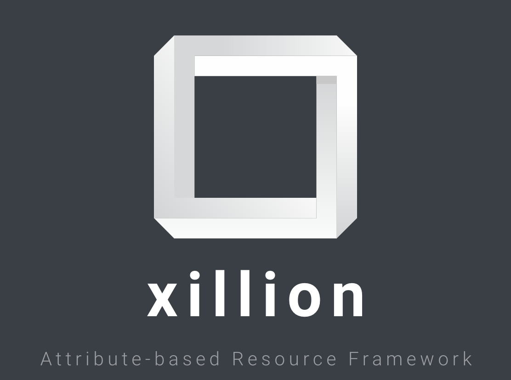

Xillion
=======

Xillion is an Attribute-based Resource Framework.

It allows you to work with Resources and their collection of attributes.

## Use-cases:

* Use your entities in XACML, ABAC, OPA and other external policy-based frameworks
* Standardise the way remote objects from different sources are represented for integration purposes

## Definitions:

* Resource: representation of 1 real-world entity. Has a unique ID (in the form of a URL) and an array of Attributes
* Attribute: Defines a single attribute. Has a unique ID (in the form of a URL), description, an AttributeType and other metadata
* DataType: Data type supported by an Attribute (i.e. string, int, etc)
* ResourceRepository: Container for a set of Resources that allows you to search, get and set Resource instances in bulk
* ResourceContext: Container for a set of Resources Repositories. The root of the structure.
* Profile: A "Contract" or "Interface", specifying which attributes Resources of this type need to "implement'. A single Resource can implement multiple profiles simultaniously.

## Features:

* Specify a Attributes, DataTypes, Profiles and Resources to use in your projects in YAML configuration files
* Predefined instances of [xml schema datatypes](https://www.w3.org/TR/xmlschema-2/) are provided that are commonly used in XACML environments
* Resource Repositories: currently ArrayRepository, with plans for PDO and Elasticsearch based Repositories.
* Resource Loader
* Resource Resolver that can resolve pre-populated Resources with their attributes and types from objects through various means (currently direct and provider-based)
* Resolve Resources directly from your entities: Quick and simple method if you "own" those entities.
* Resolve Resources through a ResourcesProvider: Useful to extract attributes for entities from external libraries.
* Collect your resources in a single Resource Context for bulk operations
* Validate one Attribute, a Resource or an entire Resource Context

## Inspiration

* XACML (+JSON profile)
* LDAP
* FHIR
* Open Policy Agent
* SAML2

## License

MIT. Please refer to the [license file](LICENSE) for details.

## Brought to you by the LinkORB Engineering team

 
Check out our other projects at [linkorb.com/engineering](http://www.linkorb.com/engineering).

Btw, we're hiring!
